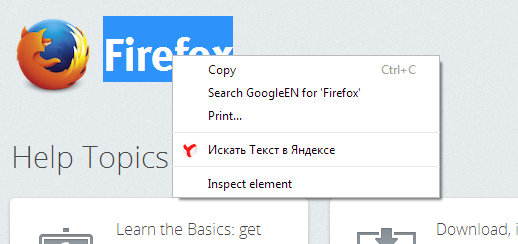

Yandex Search Context Menu Item
===============================
*This is just simple Google Chrome Extension. It is hardcoded to work with Yandex, because I don`t need anything else at this moment.*

Features
--------

* New tab will open in the same window 1 tab after the current tab. 
* Current tab will stay selected.
* 2 different behaviours for images and text selections:

Selected Text 
-------------

Right Mouse Click on Image 
-------------
